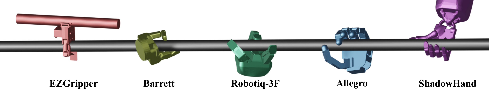
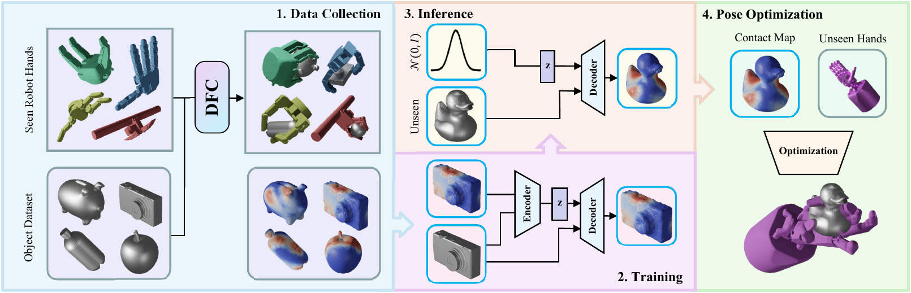

# GenDexGrasp
Code Repository for ICRA 2023 Submission paper **GenDexGrasp: Generalizable Dexterous Grasping**

by [Puhao Li](https://github.com/Xiaoyao-Li)<sup> *</sup>, [Tengyu Liu](http://tengyu.ai/)<sup> *</sup>, [Yuyang Li](https://github.com/YuyangLee), [Yiran Geng](https://github.com/GengYiran), [Yixin Zhu](https://yzhu.io/), [Yaodong Yang](https://www.yangyaodong.com/), [Siyuan Huang](https://siyuanhuang.com/)

<p align="center">
    <a href=''>
      
    </a>
    <a href='https://blog-img-1302618638.cos.ap-beijing.myqcloud.com/uPic/ICRA23_GenDexGrasp.pdf'>
      
    </a>
    <a href='https://sites.google.com/view/gendexgrasp/home'>
      
    </a>
</p>


Generating dexterous grasping has been a longstanding and challenging robotic task. Despite recent progress, existing methods primarily suffer from two issues. First, most prior arts focus on a specific type of robot hand, lacking *generalizable* capability of handling unseen ones. Second, prior arts oftentimes fail to *rapidly* generate *diverse* grasps with a *high success rate*. To jointly tackle these challenges with a unified solution, we propose **GenDexGrasp**, a novel hand-agnostic grasping algorithm for generalizable grasping. 



GenDexGrasp is trained on our proposed large-scale multi-hand grasping dataset [**MultiDex**](https://sites.google.com/view/gendexgrasp/multidex) synthesized with force closure optimization. By leveraging the contact map as a hand-agnostic intermediate representation, GenDexGrasp efficiently generates diverse and plausible grasping poses with a high success rate and can transfer among diverse multi-fingered robotic hands. Compared with previous methods, GenDexGrasp achieves a three-way trade-off among success rate, inference speed, and diversity.

## Pipeline

We first collect a large-scale synthetic dataset for multiple robotic hands with [Differentiable Force Closure](https://arxiv.org/abs/2104.09194). Then, we train a CMap-CVAE to generate hand-agnostic contact maps for unseen objects. We finally optimize grasping poses for unseen hands using the generated contact maps.



## Dependencies

Run the following instruction in a conda environment to build the dependencies

```sh
conda install requirements.yaml
```

Note that the `pytorch_kinematics` dependency is modified, you should install it from the source code in `./thirdparty/pytorch_kinematics/`

## Data Preparation

#### Robots and Objects

We train and test on 58 daily objects from [YCB](https://www.ycbbenchmarks.com/) and [ContactDB](https://contactdb.cc.gatech.edu/) dataset, together with 5 robotic hands(EZGripper, Barrett Hand, Robotiq-3F, Allegro and Shadowhand) ranging from two to five fingers.

You can download `data.zip` from [Google Drive](https://drive.google.com/file/d/1WRV7m9AAfDOFE6Z9InIRJwhhlRUSQzCX/view?usp=sharing) or [Baidu Netdisk](https://pan.baidu.com/s/1UGC9Nhqp0C799bJ7IXz2iQ?pwd=md8u), then extract it to the root as

```sh
GenDexGrasp
+-- data
|  +-- object
|  |  +-- contactdb
|  |  +-- ycb
|  +-- urdf
|  |  ...
```

#### MultiDex Dataset

We synthesis a large-scale `MultiDex` Dataset with [Differentiable Force Closure](https://arxiv.org/abs/2104.09194), you can download `MultiDex.zip` from [Google Drive](https://drive.google.com/file/d/1r0rV5eEtvoy8bF02uwo1bFfMn7Ya3gJx/view?usp=sharing) or [Baidu Netdisk](https://pan.baidu.com/s/1IWiBqQiwe6qV11Q6l_2hKQ?pwd=4h2n), then extract it to the root as

```bash
GenDexGrasp
+-- MultiDex
|  +-- shadowhand
|  +-- allegro
|  +-- robotiq_3finger
|  +-- barrett
|  +-- ezgripper
|  +-- robot_object_names.json
```

#### Contact Map Dataset

We construct `CMapDataset` from Grasp Dataset to train our CMap-CVAE model in our pipeline. You can download `dataset.zip` from [Google Drive](https://drive.google.com/file/d/1yKymFebrfYFyBACR3h49JmJAdD0-qeg3/view?usp=sharing) or [Baidu Netdisk](https://drive.google.com/file/d/1yKymFebrfYFyBACR3h49JmJAdD0-qeg3/view?usp=sharing), and extract it to the root.

#### IsaacGym Assets

We create a testing task using IsaacGym simulators to evaluate the stability of our generated grasp pose for objects and robotic hands. You can download `env.zip` from [Google Drive](https://drive.google.com/file/d/1M_biyC7XcajSvat9FENI93kQtMA46h_3/view?usp=sharing) or [Baidu Netdisk](https://pan.baidu.com/s/1y1Rg8GyfZ2mIZZbscDoEqg?pwd=q8n1), and extract it to the root as same as `data.zip` to build the tasks and assets.

## Usage

#### Train CMap-CVAE

Train CMap-CVAE model through `train_cvae.py`, 

```bash
python train_cvae.py
  --comment: str, comments for your log directory.
  --id: int, identify this experiment.
  --batchsize: int, training batch size.
  --n_epochs: int, training epochs.
  --lr: float, training learning rate.
  --lw_recon: float, weight of reconstruction loss. 
  --lw_kld: float, weight of kl-divergence loss.
  --ann_temp: float, rising tempreture of 'lw_kld'.
  --ann_per_epochs: int, every 'ann_per_epochs' epochs apply 'ann_temp' on 'lw_kld'.
  --disable_shadowhand: store_ture, removing shadowhand grasping data, let shadowhand unseen in training.
  --disable_allegro: store_ture, removing allegro grasping data.
  --disable_robotiq_3finger: store_ture, removing robotiq-3f grasping data.
  --disable_barrett: store_ture, removing barrett grasping data.
  --disable_ezgripper: store_ture, removing ezgripper grasping data.
  --seed: int, global random seed(default: 42).
```

For instance, you can run

```bash
python train_pointnet_cvae.py --id=0 --disable_shadowhand --comment=example --batchsize=128 --n_epochs=36 --lr=1e-4 --lw_recon=1000 --lw_kld=0.05 --ann_temp=1.5 --ann_per_epochs=2 --batches_per_print=500 --attn_loss_alpha=3.
```

to train a CMap-CVAE, which `shadowhand` is an out-of-domain robotic hand.

#### Inference CMap

After training CMap-CVAE or preparing the pre-trained weight in `./ckpts/`, you can inference the contact map for our-of-domain objects through `inf_cvae.py`, 

```bash
python inf_cvae.py
  --comment: str, comments for your log directory.
  --pre_process: str, process operator for inference cmap.
  --s_model: str, pre-trained model name you defined, can reorient in this scripts follwing the existing config.
  --num_per_seen_object: int, numbers of inference cmaps per in-domain object.
  --num_per_unseen_object: int, numbers of inference cmaps per out-of-domain object.
```

For instance, you can run

```bash
python inf_cvae.py --comment=example --s_model=PointNetCVAE_SqrtUnseenShadowhand --pre_process=sharp_lift --num_per_seen_object=4 --num_per_unseen_object=64
```

with the pre-trained weight in `./ckpts/SqrtUnseenShadowhand/weights/`.

#### Grasp Pose Generation

Constructing inference cmap data for pose generation as

```bash
GenDexGrasp
+-- dataset
|  +-- CMapInfSet
|  |  +-- DATASET_NAME
|  |  |  +-- DATASET_ID
|  |  |  |  +-- cmap_id.pt
|  |  |  |  +-- cmap_ood.pt
|  |  |  |  +-- split_train_validate_objects.json
```

, you can generate the grasp pose through `run_grasp_gen.py`

```bash
python run_grasp_gen.py
  --comment: str, comments for your log directory.
  --robot_name: str, name of robotic hand.
  --dataset: str, DATASET_NAME.
  --dataset_id: str, DATASET_ID.
  --max_iter: int, steps for adam optimization.
  --steps_per_iter: NO USE.
  --num_particles: int, numbers of initial poses.
  --learning_rate: float, adam learning rate.
  --init_rand_scale: float, ranging from 0 to 1.
  --domain: str, 'ood' refers to out-of-domain objects, 'id' refers to in-domain objects, 
  --object_id: int, object id in sort of object sets in .json file.
  --energy_func: str, 'align_dist' refers to aligned distance energy, 'euclidean_dist' refers to euclidean distance energy.
```

For instance, you can run

```bash
python run_grasp_gen.py --comment=example --robot_name=shadowhand --dataset=SqrtFullRobots --dataset_id=SharpClamp_A3 --max_iter=100 --num_particles=32 --learning_rate=5e-3 --init_rand_scale=0.5 --domain=ood --object_id=0 --energy_func=align_dist
```

to generate the grasping pose for out-of-domain robotic hand `shadowhand` and out-of-domain object which is the `object_id`-th object in `split_train_validate_objects.json` file.

#### Stability Test

You should firstly download the Isaac Gym Preview 4 release from the [Isaac Gym Web](https://developer.nvidia.com/isaac-gym), then follow the installation instructions in the documentation.

Test the stability of grasping pose generated from our method through `run_grasp_test.py`, 

```bash
python run_grasp_test.py
  --comment: str, comment you set when genrate poses.
  --robot_name: str, name of robotic hand.
  --dataset: str, log name of your generated grasp pose directory in path `logs_gen`.
  --domain: str, 'ood' refers to out-of-domain objects, 'id' refers to in-domain objects, 
  --base_name: energy_func you set when genrate poses.
  --mode: str, mode(default: 'test').
```

For instance you can run 

```bash
python run_grasp_test.py --comment= --robot_name=shadowhand --dataset=SqrtUnseenShadowhand-SharpClamp_A3 --domain=ood --base_name=align_dist --comment=example
```

to test the stability of grasps generated from our method, which report the success rate of our grasps.

#### MultiDex Visualization

Visualize the `MultiDex` grasp data through `vis_multidex.py`

```bash
python vis_multidex.py
  --robot_name: str, name of robotic hand.
  --object_name: str, name of object.
  --num_vis: int, number of visualization.
```

, and you can read the name list of robotic hand and object in `./MultiDex/robot_object_names.json`.


## TODO

+ [x] Inference
  - [x] Model Weights
  - [x] Inference Code
+ [x] Train
  + [x] Training Data (CMap Dataset)
  + [x] Training Code
+ [x] Env
  - [x] Dependency (requirements.txt)
  - [x] pytorch_kinematics
  - [x] IsaacGym
+ [x] MultiDex Dataset
  + [x] Download link
  + [x] Usage
